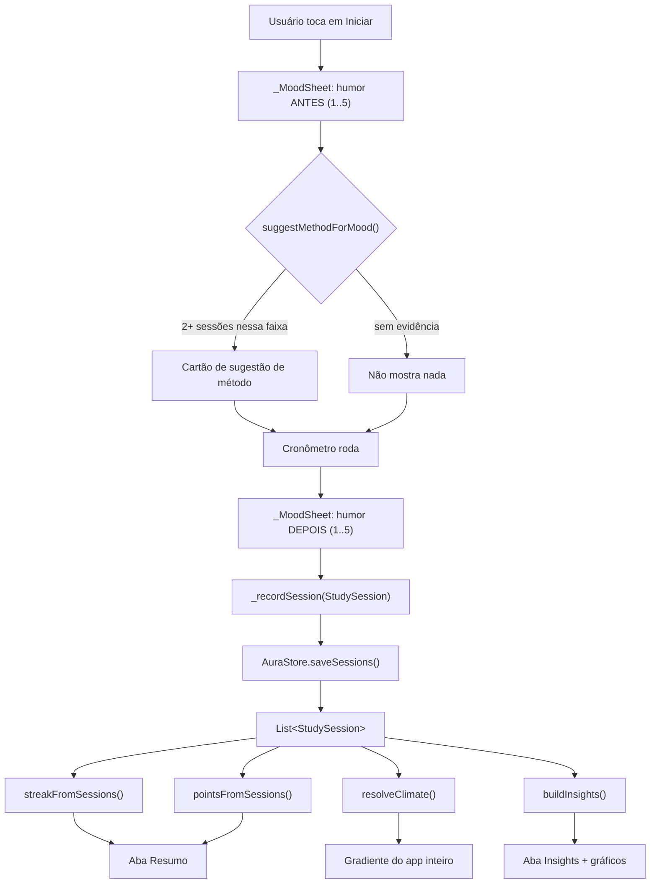
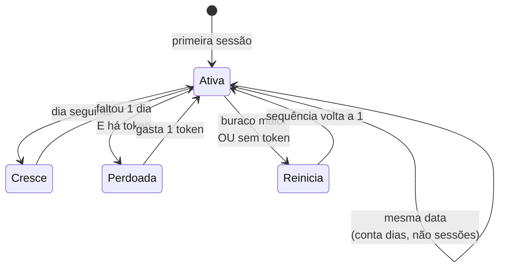

# Arquitetura — Aura

Documento para quem for mexer no código. Descreve como o app está organizado, por onde os
dados passam e onde ficam as regras. Para o *porquê* de cada escolha, veja
[`DECISOES.md`](DECISOES.md).

---

## 1. Arquivo único, e o que isso obriga

Todo o app vive em **`lib/main.dart`** (4.280 linhas). Não é preferência de estilo: o
FlutLab tem problemas com arquitetura multi-arquivo no navegador, então a especificação
proibiu imports relativos.

Sem pastas para separar responsabilidades, a separação é feita por **faixas do arquivo**,
marcadas com banners. A ordem importa: cada faixa só depende das anteriores.

### Mapa navegável

Um arquivo de 4.280 linhas é intransitável sem mapa. As linhas abaixo são os banners de
seção — abra o arquivo e pule direto para a faixa que interessa.

| Linha | Seção | Camada |
|---:|---|---|
| 1 | `main()`, `AuraCrashReport`, `AuraApp`, `AuraErrorScreen` | infraestrutura |
| **205** | `MODELOS` | dados puros |
| **352** | `CONSTANTES DE APOIO` — `kBrandIndigo`, escalas, datas, formatação | dados puros |
| **432** | `PERSISTÊNCIA (shared_preferences)` — `AuraStore` | persistência |
| **562** | `SEQUÊNCIA COM PERDÃO` | **lógica pura** |
| **677** | `MOTOR DE INSIGHTS` | **lógica pura** |
| **1035** | `SUGESTÃO ADAPTATIVA DE DURAÇÃO` | **lógica pura** |
| **1107** | `FICHA DE PERSONAGEM` — `buildCharacterSheet` | **lógica pura** |
| **1257** | `CLIMA PESSOAL (a "aura")` | **lógica pura** |
| **1347** | `DATASET DE DEMONSTRAÇÃO` | **lógica pura** |
| **1435** | `SHELL PRINCIPAL` — `_HomeShellState` | estado |
| **1840** | `TELA 1: FOCO` — cronômetro, método, check de humor | UI |
| **2817** | `TELA 2: TAREFAS` | UI |
| **2968** | `TELA 3: INSIGHTS` — motor de correlação e gráficos | UI |
| **3447** | `TELA 4: RESUMO` — a ficha | UI |
| **3648** | `TELA: SOBRE` | UI |
| **3892** | `WIDGETS COMPARTILHADOS` — `AuraCard`, `AuraMark`, `EntranceFade` | UI |

A faixa do meio (562–1434) é a mais importante: **é lógica pura, sem nenhuma dependência de
Flutter**. Funções que recebem `List<StudySession>` e devolvem números ou objetos de dados.
É por isso que 54 dos 77 testes conseguem rodar sem construir uma única tela.

> As linhas envelhecem a cada edição. Se divergirem, o que vale são os banners no próprio
> arquivo — `grep -n '^// [A-Z]\{4,\}' lib/main.dart` reconstrói esta tabela em um comando.

---

## 2. As quatro camadas

```
┌──────────────────────────────────────────────────────────┐
│  UI          HomeShell → FocusPage / TaskListPage /      │
│              InsightsPage / SummaryPage / AboutPage      │
├──────────────────────────────────────────────────────────┤
│  Lógica      buildInsights · applyActivity ·             │
│  pura        resolveClimate · suggestMethodForMood ·     │
│              buildCharacterSheet · streakFromSessions ·  │
│              buildDemoSessions                           │
├──────────────────────────────────────────────────────────┤
│  Persistência           AuraStore (shared_preferences)   │
├──────────────────────────────────────────────────────────┤
│  Modelos     StudySession · TaskItem · FocusMethod ·     │
│              StreakState · Insight · AuraClimate ·       │
│              CharacterSheet                              │
└──────────────────────────────────────────────────────────┘
```

A camada de lógica **não conhece** a de persistência: recebe listas prontas. Quem lê do
disco é sempre o `_HomeShellState`, que então passa os dados para baixo. Isso é o que torna
a lógica testável sem `SharedPreferences` mockado.

### O ciclo de vida de uma sessão

Este é o caminho que faz o app inteiro funcionar. Repare que **tudo que é derivado nasce da
lista de sessões** — nada é gravado como número solto:



`_recordSession` ser o **único** ponto de entrada é o que garante isso. Quando o dataset de
demonstração gravava sessões por fora desse caminho, a tela Resumo abria com "0 dias de
sequência" ao lado de "20 sessões totais" — o defeito está registrado em
[`DECISOES.md`](DECISOES.md) §9.

---

## 3. Estado

`StatefulWidget` + `setState()`, sem pacote de gerenciamento de estado.

O `_HomeShellState` é o dono de tudo que persiste — sessões, tarefas, pontos, sequência — e
passa para as telas por parâmetro, recebendo callbacks de volta:

```
_HomeShellState
├── _sessions, _tasks, _points, _streak
├── _recordSession(StudySession)   ← ponto único de entrada de sessão concluída
├── _addTask / _toggleTask / _removeTask
└── _applySessions(List)           ← troca o conjunto e recalcula o que depende dele
```

`_recordSession` é deliberadamente o **único** caminho por onde uma sessão entra: ele grava,
credita os 10 pontos e atualiza a sequência. Espalhar isso seria a forma mais fácil de a
tela Resumo voltar a ficar incoerente.

---

## 4. Modelo de dados

### `StudySession` — a unidade que alimenta tudo

```dart
DateTime date;
int durationMinutes;
int moodBefore;      // 1..5
int moodAfter;       // 1..5
String? linkedTaskId;
String methodId;
bool isDemo;         // extensão nossa, ver DECISOES.md
```

JSON gravado (note que a chave é `duration`, não `durationMinutes`):

```json
{
  "date": "2026-08-18T14:30:00.000",
  "duration": 52,
  "moodBefore": 3,
  "moodAfter": 5,
  "linkedTaskId": "task_1755526200000000",
  "methodId": "52_17",
  "isDemo": false
}
```

`fromJson` é **retrocompatível de propósito**: `methodId` ausente vira
`pomodoro_classico` e `isDemo` ausente vira `false`, para que dados gravados por versões
anteriores continuem abrindo. O mesmo vale para `TaskItem`, que sintetiza um `id` quando o
registro salvo não tem um.

### Chaves no `shared_preferences`

| Chave | Conteúdo |
|---|---|
| `tasks` | lista de `TaskItem` em JSON |
| `sessions` | lista de `StudySession` em JSON |
| `points` | inteiro |
| `streak`, `forgivenessTokens`, `streakRunLength`, `lastActiveDay` | estado da sequência |
| `demoSeeded` | se o dataset de demonstração já foi semeado |
| `selectedMethodId` | último método escolhido |
| `customFocusMinutes`, `customBreakMinutes` | durações do método Personalizado |

Leitura de listas passa por `AuraStore._loadList`, que envolve o `jsonDecode` em
`try/catch`, descarta o valor ilegível e registra o motivo. Sem isso, um único registro
malformado deixa o app impossível de abrir para sempre.

---

## 5. As regras de negócio

### Motor de insights

`buildInsights(sessions)` devolve sempre 5 objetos `Insight`. Cada um tem um volume mínimo
de dados; abaixo dele o card aparece bloqueado, mostrando quantas sessões faltam — o
bloqueio é a própria mecânica, não um erro.

| Insight | Cálculo | Mínimo |
|---|---|---|
| Humor prevê foco | duração média por faixa de `moodBefore` | 5 sessões, 2+ faixas |
| Focar muda humor | média de `moodAfter - moodBefore` | 5 sessões |
| Melhor dia | minutos totais por dia da semana | 7 sessões |
| Método que sustenta | `moodAfter` médio por `methodId` | 6 sessões, 2+ métodos com 2+ sessões |
| **Seu limite real** | `moodAfter` médio por faixa de duração | **30 sessões**, 3 faixas com 3+ sessões |

Faixas de humor (`_moodBucket`): **1-2** baixo, **3** neutro, **4-5** alto.

O quinto limiar é alto de propósito. Com as 22 sessões da demonstração ele **nasce
bloqueado**, e é isso que faz a mecânica de desbloqueio finalmente aparecer na tela: antes
dele os quatro primeiros abriam todos de saída, e ninguém — nem um usuário novo, nem a
plateia de uma apresentação — via um cartão trancado. Ver [`DECISOES.md`](DECISOES.md) §21.

### Ficha de personagem

`buildCharacterSheet(sessions)` devolve uma **classe** e **quatro atributos**, e nenhum deles
é inventado:

| Campo | De onde sai |
|---|---|
| Classe | família de duração do método mais usado — Maratonista (50+), Ritmista (25–45), Sprinter (≤20), Explorador (Flowtime) |
| Constância | `effectiveStreak`, normalizada por 21 dias |
| Recuperação | % de sessões com `moodAfter > moodBefore` |
| Amplitude | diferença de duração média entre a faixa de humor mais alta e a mais baixa |
| Profundidade | maior `durationMinutes`, normalizada por 90 min |

Cada atributo carrega `value` (0–100, só para a largura da barra) **e** `display`, o número
real com unidade. A barra é leitura de relance; o número é o dado. Os tetos de normalização
são alvos declarados no código, não escalas escondidas — e o valor satura em 100 em vez de
estourar a barra, com teste que trava isso.

### Sequência com perdão

`applyActivity(prev, now)` é uma função pura de transição:

- mesma data → nada muda (a sequência conta dias, não sessões)
- dia seguinte → sequência cresce
- faltou **exatamente um** dia **e** há token → gasta o token, sequência sobrevive
- qualquer outro buraco → recomeça do 1



A cada 3 dias acumulados ganha-se 1 token, com teto de 3.

`effectiveStreak(state, now)` existe porque guardar o número no disco não basta: se o
usuário sumiu por vários dias, a sequência já está quebrada mesmo sem nenhuma sessão nova
ter sido registrada.

`streakFromSessions(sessions)` reconstrói o estado aplicando `applyActivity` dia a dia — é
o que mantém a tela Resumo coerente quando o dataset de demonstração é ligado ou desligado.

### Clima pessoal

`resolveClimate(sessions)` olha só as **3 sessões mais recentes** e calcula a média de
`moodAfter`:

| Média | Estado |
|---|---|
| ≥ 4.2 | Radiante |
| ≥ 3.4 | Fluindo |
| ≥ 2.4 | Nublado |
| < 2.4 | Recolhido |
| sem sessões | Aura em branco |

Olhar só as recentes é intencional: a aura reflete o estado atual, não a média histórica.
O gradiente é aplicado no fundo do app inteiro, com `AnimatedContainer`, então a mudança é
visível em todas as abas.

### Sugestão adaptativa

`suggestMethodForMood(sessions, mood)` filtra as sessões da mesma faixa de humor, exige 2+
sessões por método e devolve o de melhor `moodAfter` médio — desempate por maior duração
sustentada. Devolve `null` quando não há evidência. Flowtime e Personalizado são excluídos.

### Dataset de demonstração

`buildDemoSessions()` gera 22 sessões dos últimos 14 dias com `math.Random(7)` — **semente
fixa**, para a apresentação ser sempre idêntica. Os dados carregam de propósito a
correlação que o app promete descobrir: quem começa com humor melhor escolhe métodos mais
longos e sustenta mais tempo.

---

## 6. Tratamento de erro

`main()` instala três camadas antes de subir o app:

- `FlutterError.onError` — erros de build/layout
- `platformDispatcher.onError` — erros assíncronos
- `runZonedGuarded` — o que escapar dos dois

Tudo é registrado em `AuraCrashReport`, e o último erro aparece na tela **Sobre** — erros
assíncronos não derrubam mais o app, e por isso mesmo passariam despercebidos.

`AuraErrorScreen` é usada em três lugares: como `ErrorWidget.builder`, como tela quando o
app não sobe, e quando a carga inicial falha. Por isso ela **traz os próprios
`Directionality` e `Material`** e não usa `Scaffold` nem `SafeArea`: uma tela de erro que
depende de ancestrais lança ao ser desenhada e vira um laço infinito, escondendo justamente
o erro que veio mostrar.

---

## 7. A regra de cor

Duas famílias de cor conviviam sem critério: o ícone e a tela de abertura eram índigo, e a
interface era verde-azulada, porque quase tudo usava `climate.accent`. O app parecia trocar
de produto depois da abertura.

```
kBrandIndigo (0xFF6C63FF)  →  ESTRUTURA DO APP
                              marca, anel do cronômetro, botões,
                              números de insight, ícones de estatística

AuraClimate.accent         →  ESTADO DO USUÁRIO
                              o gradiente de fundo, o brilho da marca,
                              o halo do anel, "Sessões hoje"

cores semânticas           →  EXCEÇÃO: quando a cor É a informação
                              prioridade de tarefa, faces do check de humor
```

A exceção é deliberada e limitada: em `_priorityColor` e em `moodColors` a cor carrega
significado que índigo e verde-azulado não conseguem transmitir. Fora desses dois lugares,
qualquer terceira cor na interface é um desvio da regra.

A constante vive em `CONSTANTES DE APOIO` (linha 352) com a regra escrita na própria
docstring, para quem for mexer no código não precisar achar este documento.

---

## 8. Animação, e a restrição que ela impõe aos testes

O app tem **uma única animação contínua**: o halo que respira em volta do anel, enquanto a
sessão roda. Todas as outras são finitas — entram, terminam e param.

Isso não é preferência estética, é uma restrição de teste. `pumpAndSettle()` espera **todas**
as animações acabarem; qualquer animação que repete infinitamente faz o teste esperar para
sempre. Como 25 chamadas da suíte usam `pumpAndSettle`, uma animação contínua mal colocada
derruba a suíte inteira.

| Onde | O quê | Duração |
|---|---|---|
| Abertura | tela nativa → `AuraLoadingScreen` → app | dissolvência de 450 ms |
| Marca do Aura | entrada com escala e opacidade | 520 ms |
| Troca de aba | dissolvência com deslize curto | 260 ms |
| Cards de insight e gráficos | entrada escalonada, via `EntranceFade` | 620 ms, atraso por índice |
| Gráficos `fl_chart` | barras e linha crescendo | 750 ms |
| Anel do cronômetro | progresso suave entre segundos | 300 ms |
| Aura (fundo) | transição entre climas | 700 ms |
| **Halo do anel** | **respira — contínua** | 2600 ms, alternando |

O escalonamento do `EntranceFade` sai de um `Interval` na curva, **não** de
`Future.delayed`: assim continua sendo uma animação só, finita, e o `pumpAndSettle` termina.

`_breath` é parado em todos os pontos onde a sessão para — pausar, reiniciar, fim de ciclo
e fim de Flowtime. Os dois testes que rodam o cronômetro usam `pump(Duration)` no lugar de
`pumpAndSettle`, e há um teste que verifica justamente isto: o halo anima durante a sessão
e para ao pausar.

## 9. Restrições do FlutLab respeitadas pelo código

| Restrição | Como aparece no código |
|---|---|
| Arquivo único, sem imports relativos | tudo em `lib/main.dart` |
| Sem `.withOpacity()` (depreciado) | `.withValues(alpha:)` em todo lugar |
| Sem `CardTheme`/`CardThemeData` | `AuraCard` é `Container` + `BoxDecoration` |
| Dependências enxutas | 4 pacotes; mais que isso degrada o Hot Preview |
| Nada de câmera, sensores ou notificações | nenhum item do MVP depende disso |

Também foram evitados `DropdownButtonFormField` (a API mudou entre versões) e
`Iterable.firstOrNull`, ambos por compatibilidade com SDKs mais antigos que o FlutLab pode
estar rodando.

---

## 10. Testes

```bash
flutter test          # 77 testes
```

| Arquivo | Testes | Foco |
|---|---|---|
| `test/aura_logic_test.dart` | 54 | lógica pura: sequência, insights, sugestão, clima, dataset, serialização |
| `test/aura_app_test.dart` | 23 | interface: navegação, fluxo de humor, gráficos, animação, resiliência, tela de erro |

Os testes de interface rodam num viewport de telefone (420×940) em vez do padrão 800×600 —
foi assim que apareceu um estouro de layout que o padrão escondia.

> **Ao alternar entre SDKs, rode `flutter clean` antes.** Sem isso, o `build/` fica com o
> `shaders/ink_sparkle.frag` de um SDK e o outro falha ao carregá-lo:
>
> ```
> Exception: Asset 'shaders/ink_sparkle.frag' manifest could not be decoded:
> INVALID_ARGUMENT: Runtime stages buffer failed verification.
> ```
>
> O sintoma é um teste de toque quebrando com uma mensagem que não tem nada a ver com o
> código — o `ink_sparkle` é o splash de tinta do Material, carregado quando o teste toca num
> botão. `rm -rf .dart_tool` **não** basta; é o `flutter clean` que limpa o `build/`.

Testes **não** cobrem aparência. A interface foi conferida separadamente, servindo o build
web e navegando com captura de tela; ver [`RELATORIO-E2E.md`](RELATORIO-E2E.md) §3.2.
