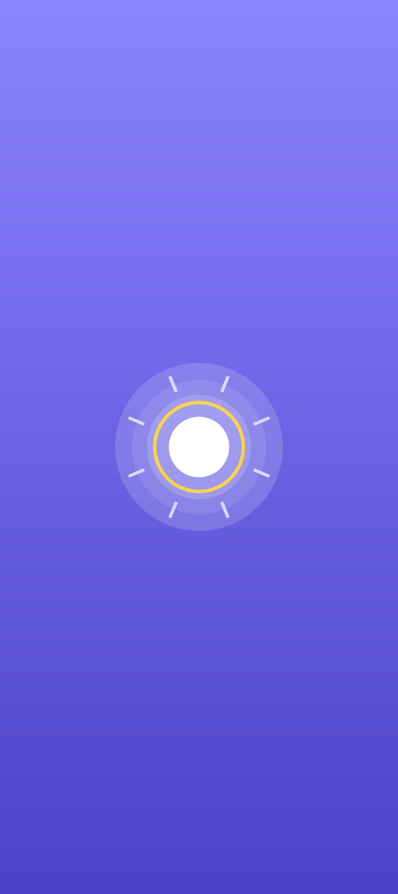
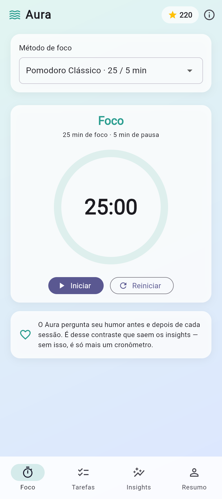
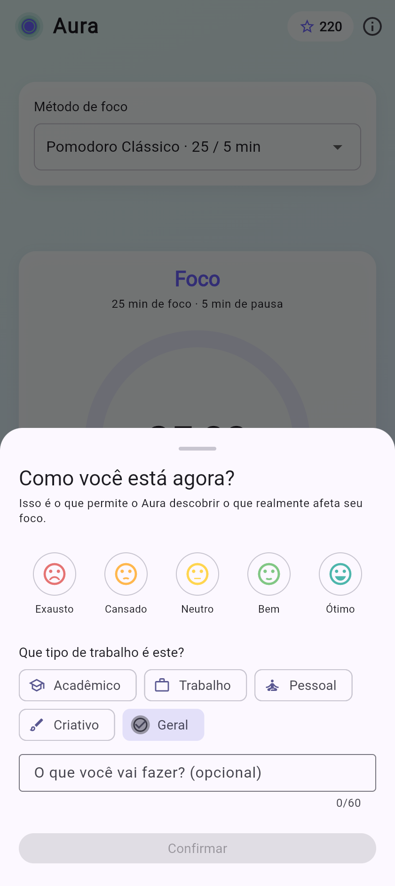
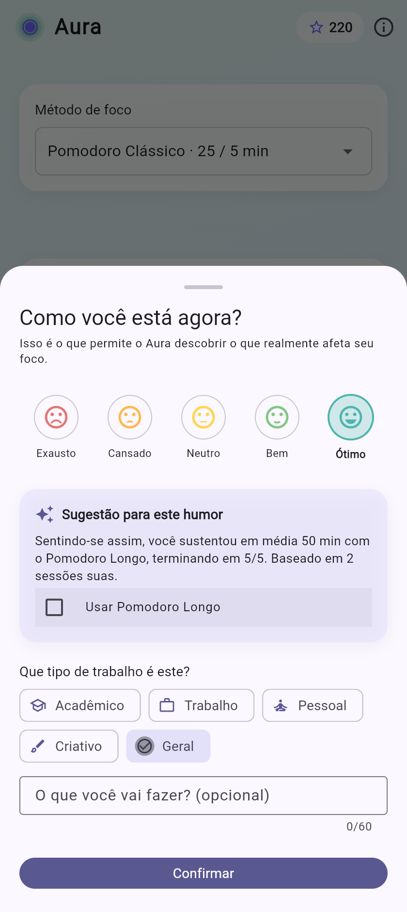
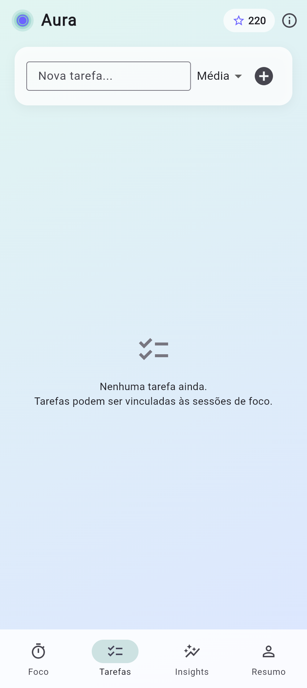
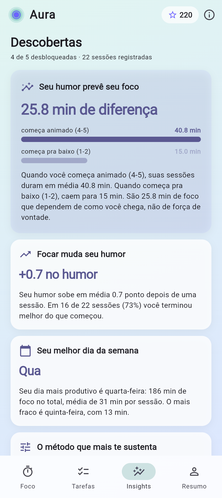
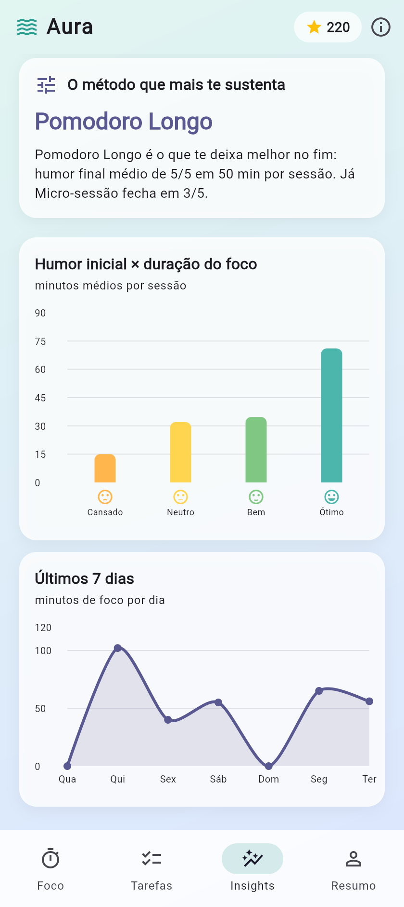
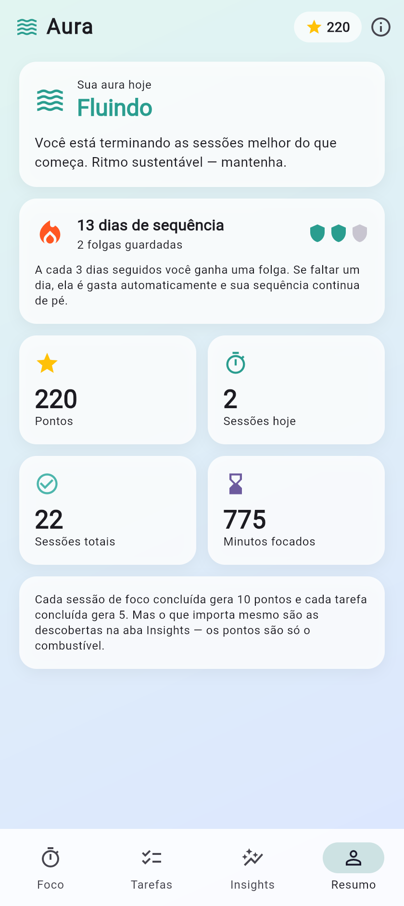
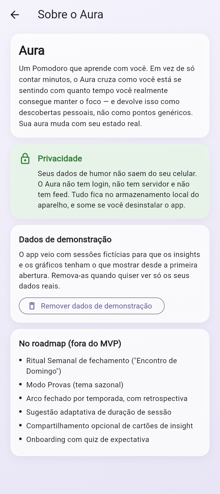

# Manual do Usuário — Aura

O Aura é um Pomodoro que aprende com você. Em vez de só contar minutos, ele cruza como você
está se sentindo com quanto tempo consegue realmente manter o foco, e devolve isso como
descobertas pessoais.

Tudo fica no seu aparelho. Não há login, servidor nem feed.

---

## Ao abrir o app

  

A abertura é a mesma marca do ícone, no mesmo índigo. Ela não pisca branco nem mostra um
carregamento genérico: a tela de abertura dissolve direto na cor da **sua** aura, que é a cor
que o app vai manter enquanto você usa.

Se você vir um flash branco ou o ícone padrão do Flutter, o aplicativo instalado é de uma
versão anterior.

## Primeira abertura

O app já abre com **22 sessões de demonstração** dos últimos 14 dias, para que nenhuma tela
apareça vazia e você veja de imediato o que ele faz. Elas são fictícias e podem ser
removidas a qualquer momento na tela **Sobre** — suas sessões reais não são afetadas.

---

## Aba Foco

É onde as sessões acontecem.

**1. Escolha o método.** O seletor no topo traz 11 opções, do Pomodoro Clássico (25/5) ao
Ciclo Ultradiano (90/20). Duas são diferentes das demais:

- **Flowtime** não tem duração fixa: o cronômetro conta para cima e você decide quando
  parar. A pausa sugerida cresce com o tempo que você sustentou.
- **Personalizado** deixa você definir os minutos de foco e de pausa.

**2. Toque em Iniciar.** Antes de o cronômetro rodar, o app pergunta como você está.

**3. Foque.** O anel mostra o progresso, e enquanto a sessão roda um halo **respira** em
volta dele — é o sinal de que o cronômetro está ativo, visível de longe. Ao pausar, o halo
para. Dá para pausar e reiniciar a qualquer momento.

**4. Ao terminar**, o app pergunta como você está agora. É o contraste entre as duas
respostas que alimenta os insights — sem ele, o Aura seria só mais um cronômetro.

---

## O check de humor

Cinco opções, de Exausto a Ótimo. Você também pode vincular a sessão a uma tarefa da sua
lista, o que é opcional.

### A sugestão adaptativa

Assim que você escolhe o humor, se já houver histórico suficiente, o app sugere o método
que **historicamente funciona melhor para você nesse estado** — dizendo quanto tempo você
costuma sustentar e com que humor termina.

Marque a caixa para usar o método sugerido; ignorar é o padrão. Se você ainda não tem
sessões suficientes naquele humor, o app **não** mostra sugestão nenhuma, em vez de chutar.

---

## Aba Tarefas

Lista simples com prioridade Alta, Média ou Baixa. Cada tarefa concluída vale 5 pontos.

A utilidade principal é o vínculo: ao iniciar uma sessão, você pode dizer em qual tarefa
vai trabalhar, e essa informação fica junto da sessão.

---

## Aba Insights

O coração do app. Quatro descobertas, calculadas a partir das suas sessões:

| Descoberta | O que responde | Libera com |
|---|---|---|
| **Seu humor prevê seu foco** | quanto tempo a mais você sustenta quando começa bem | 5 sessões |
| **Focar muda seu humor** | se as sessões te deixam melhor do que te encontraram | 5 sessões |
| **Seu melhor dia da semana** | em que dia você rende mais | 7 sessões |
| **O método que mais te sustenta** | qual dos 11 funciona melhor para você | 6 sessões |

Cada uma aparece **bloqueada** até haver dados suficientes, mostrando quantas sessões
faltam. Isso é proposital: uma descoberta baseada em duas sessões não seria uma descoberta.

### Os gráficos

**Humor inicial × duração do foco** é a leitura visual da tese do app: cada barra é uma
faixa de humor, e a altura é quanto tempo você sustentou em média começando assim.

**Últimos 7 dias** mostra os minutos de foco por dia, para você enxergar o ritmo recente.

---

## Aba Resumo

### Sua aura

O fundo do app inteiro muda de cor conforme suas sessões recentes, em quatro estados:

| Estado | Quando aparece |
|---|---|
| **Radiante** | suas últimas sessões terminaram muito bem |
| **Fluindo** | você está terminando melhor do que começa |
| **Nublado** | as sessões recentes terminaram mornas |
| **Recolhido** | você vem terminando cansado |

Ela olha só as sessões mais recentes — é o seu estado agora, não a sua média histórica.

### Sequência com perdão

A cada 3 dias seguidos com sessão, você ganha **uma folga** (até 3 guardadas). Se faltar um
dia, a folga é gasta automaticamente e sua sequência continua de pé.

Isso é deliberado: a proposta é acompanhar, não punir. Um dia perdido em semana de prova não
deveria apagar três semanas de esforço.

### Pontos

10 por sessão de foco concluída, 5 por tarefa. Servem de combustível — o que importa mesmo
são as descobertas na aba Insights.

---

## Tela Sobre

Acessível pelo ícone **ⓘ** no canto superior direito. Traz a mensagem de privacidade, o
roadmap e o controle dos dados de demonstração.

Se algo tiver falhado durante o uso, um cartão vermelho mostra o último erro registrado,
com o texto que pode ser copiado para relatar o problema.

---

## Perguntas comuns

**Meus dados vão para algum lugar?**
Não. Ficam no armazenamento local do aparelho e somem se você desinstalar o app.

**Posso apagar as sessões de demonstração?**
Sim, na tela Sobre. As suas sessões reais permanecem, e dá para restaurar a demonstração
depois.

**Por que um insight está bloqueado?**
Falta volume de dados. O card diz quantas sessões faltam.

**Por que não apareceu sugestão de método?**
Você ainda não tem sessões suficientes começando naquele humor. O app prefere não sugerir
nada a sugerir com base em uma tentativa isolada.

**Por que a sequência não quebrou mesmo eu tendo faltado um dia?**
Você tinha uma folga guardada, e ela foi usada automaticamente.
